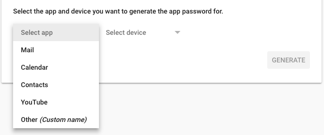

## WSPro Report

This project has been developed by Özcan ÇAĞIRICI for bootcamp innovation week

### Getting Started

These instructions will get you a copy of the project up and running on your local machine 
for development and testing purposes. 

### Google API Authorization
The first time you run the sample, it will prompt you to authorize access:
```
Please open the following address in your browser:
  https://accounts.google.com/o/oauth2/auth?client_id.........
```
if your browser will not open automatically, copy and paste link to browser and authorize.

### Configuration
Some of properties must be set before using this application.
##### application name
You can use default application name.
```
application.name = WsPro Compliance-Productivity Report
```

##### smtp configuration
You can use your private email and password. If you use gmail and 2-step verification, 
you must create an [application password](https://myaccount.google.com/apppasswords) 
for this application. </p>
Select Other (Custom name) and set this application.name value then generate.

```
mail.auth.username = xxx@aurea.com
mail.auth.password = xxxxxxxxxx
mail.replyTo = username@aurea.com
mail.cc.list=username@aurea.com,
```
mail.cc.list optinal. You can leave empty.
##### other smtp configuration

```
mail.smtp.host = smtp.gmail.com
mail.smtp.port = 587
mail.smtp.auth = true
mail.smtp.starttls.enable = true
```

##### Google SpreadSheet configuration

```
sheet.compliance.source = 1bI6YOhGianCq6koOMfWwHY9xeMwX6nCPxJghBhSN4uA
sheet.compliance.data.name = Index
sheet.compliance.data.startColumn = A2
sheet.compliance.data.endColumn = AN

sheet.compliance.email.name = MASTER_SHEET
sheet.compliance.email.startColumn = A2
sheet.compliance.email.endColumn = C
```
## Running and Debuging
### Usage for Daily Report
```
* mvn spring-boot:run dailyReport manager="<manager-name>"
or
* java -jar ws-pro-report-<version>.jar dailyReport manager="manager-name"
```
above command reports last work day, generates report and send email to active ICs work email.
#### Optinal parameters for Daily Report
```
* date = "<yyyy-MM-dd>" 
```
##### usage of date param
```
* mvn spring-boot:run dailyReport manager="<manager-name>" date="2018-12-10"
or
* java -jar ws-pro-report-<version>.jar dailyReport manager="manager-name" date="2018-12-10"
```
above command reports given date, generates report and send email to active IC's work email.
```
* dryRun : generates report but don't send email to ICs. Save report to disk.
```
##### usage of dryRun param
```
* mvn spring-boot:run dailyReport manager="<manager-name>" dryRun
or
* java -jar ws-pro-report-<version>.jar dailyReport manager="manager-name" dryRun
```
above command reports given date, generates report and save report to disk. Don't send any email.

### Usage for Weekly Report
```
* mvn spring-boot:run weeklyReport
or
* java -jar ws-pro-report-<version>.jar weeklyReport
```
above command reports last week, generates report and send email to active ICs work email.
#### Optinal parameters for Weekly Report
```
* thisweek 
```
thisweek param, creates weekly report from fist day of current week to today.
##### usage of thisweek param
```
* mvn spring-boot:run weeklyReport thisweek
or
* java -jar ws-pro-report-<version>.jar weeklyReport thisweek
```
above command report from this week monday to today and send email to active ICs work email.
```
* date = "<yyyy-MM-dd>"
```
##### usage of date param
```
* mvn spring-boot:run weeklyReport date="2018-12-10"
or
* java -jar ws-pro-report-<version>.jar weeklyReport date="2018-12-10"
```
above command report from given date to today and send email to active ICs work email.
```
* dryRun : generates report but don't send email to ICs. Save report to disk.
```
##### usage of dryRun param
```
* mvn spring-boot:run weeklyReport dryRun
or
* java -jar ws-pro-report-<version>.jar weeklyReport dryRun
```
above command reports given last week, generates report and save report to disk. Don't send any email.
```
* mvn spring-boot:run weeklyReport thisweek dryRun
or
* java -jar ws-pro-report-<version>.jar weeklyReport thisweek dryRun
```
above command reports this week, generates report and save report to disk. Don't send any email.

## Google SpreadSheet data filling
You can fill data to spreadsheet manually. But It has a time-base trigger like cron-job. It runs daily and weekly based.
Daily base trigger runs every  04:00 AM, weekly base trigger runs every Monday 04:00 AM.

## Authors

* **Özcan ÇAĞIRICI** -  [github.com/ozcancagirici](https://github.com/ozcancagirici)
